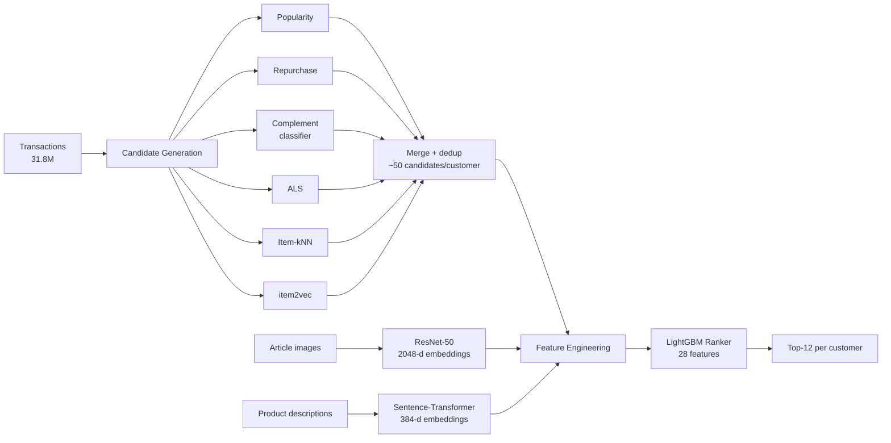

# H&M Personalized Fashion Recommendations

A two-stage recommender system that predicts the 12 articles each H&M customer is most likely to purchase in the following week. Candidate retrieval narrows ~105K articles down to ~50 plausible items per customer, and a gradient-boosted ranker reorders them — augmented with CNN image embeddings and transformer text embeddings of the product catalog.

Built on the [H&M Personalized Fashion Recommendations](https://www.kaggle.com/competitions/h-and-m-personalized-fashion-recommendations) dataset: **31.8M transactions** across **1.36M customers** and **105K articles**.

---

## Results

Evaluated with **MAP@12** on a held-out final week (validation = 2020-09-16 → 09-22, trained on everything prior). The global-popularity floor is 0.00710; the final ranker reaches **0.04169 — a 5.9× lift**.

> *All scores are measured on this self-held-out validation week, not the official Kaggle leaderboard (which scores a separate, unseen test period and is no longer open for submission), so they are not directly comparable to the competition standings.*

| Model | Description | MAP@12 |
|---|---|---|
| Global popularity *(floor)* | Top-12 trending items, same for everyone | 0.00710 |
| Segment: sales channel | Top-12 by dominant channel | 0.00673 |
| Segment: age group | Top-12 by age bucket | 0.00889 |
| Co-purchase | High-lift complement items (14-day window) | 0.01205 |
| ALS | Matrix factorization, rank 256, time-decayed | 0.01522 |
| Item-kNN | Cosine similarity on the interaction matrix | 0.02394 |
| Personal repurchase | Each customer's most recent purchases | 0.02449 |
| Repurchase + segment hybrid | Repurchase, filled with segment popularity | 0.02461 |
| **LightGBM ranker** | **Reranks merged candidates, 28 features incl. embeddings** | **0.04169** |

A systematic embedding ablation (six configurations: no embeddings → original average → item2vec → category-specific → combinations → all) showed that the learned representations measurably improved the ranker, with item2vec and category-specific embeddings contributing most. Two negative results are kept in deliberately: channel-only segmentation scored *below* the global floor, and a late ensemble never beat the standalone ranker. Reporting what didn't work is part of the evaluation, not a gap in it.

---

## Architecture



The two-stage design exists because scoring every customer against every article is intractable at this scale. Cheap heuristics and collaborative filtering propose candidates; an expensive, expressive model only has to rank a short list.

---

## Repository structure

```
hm-fashion-recommender/
├── README.md
├── requirements.txt
├── LICENSE
├── .gitignore                  # excludes data/, large artifacts, model files
│
├── data/                       # only data/README.md is tracked; contents gitignored
│   ├── README.md              # what to download and where it goes
│   ├── raw/                    # original Kaggle CSVs + images (you provide)
│   ├── parquet/                # CSVs converted to parquet (made by 00a)
│   └── split/                  # train / validation slices (made by 00b)
│
├── notebooks/
│   ├── 00a_csv_to_parquet.ipynb           # CSV → parquet conversion
│   ├── 00b_split_and_eval.ipynb           # train/val split + MAP@12 function
│   ├── 01a_eda_updated.ipynb              # profiling + 12 figures
│   ├── 01b_bias_analysis.ipynb            # 7 documented biases & limitations
│   ├── 01c_complement_analysis.ipynb      # co-purchase / basket patterns
│   ├── 02_baselines.ipynb                 # popularity, repurchase, co-purchase
│   ├── 03a_collaborative_filtering.ipynb  # ALS + item-kNN
│   ├── 03b_embeddings.ipynb               # ResNet-50 image + text embeddings
│   ├── 03c_complement_classifier.ipynb    # learned complement candidates
│   ├── 03d_item2vec_experiments.ipynb     # item2vec embeddings
│   ├── 04_ranking_model.ipynb             # feature engineering + LightGBM
│   ├── 05a_evaluation.ipynb               # final table + embedding ablation
│   └── 05b_improvements.ipynb             # potential improvements writeup
│
├── src/
│   └── eval.py                 # shared MAP@12 implementation
│
└── outputs/
    ├── figures/                # EDA + result plots
    ├── final_comparison.csv    # the model comparison table
    └── feature_importance.csv  # ranker feature importances
    # large artifacts (embeddings, candidate sets, saved models, *.pkl/*.parquet) are gitignored and regenerated by the notebooks
```

A few deliberate choices: the notebooks carry the *narrative* (numbered 00 → 05, they render on GitHub and run top to bottom), and the one shared module, `src/eval.py`, holds the MAP@12 implementation so the metric is computed identically across every model. The committed `outputs/` files are the small result tables and figures; the heavy intermediate artifacts (embeddings, candidate sets, trained models) are gitignored and reproduced by re-running the pipeline.

---

## Getting the data

The dataset is **not redistributed here** (H&M / Kaggle license it). The repo ships an empty `data/` folder with a `data/README.md`; the steps below populate it and regenerate every intermediate artifact.

1. Accept the competition rules and download from [Kaggle](https://www.kaggle.com/competitions/h-and-m-personalized-fashion-recommendations) (CLI: `kaggle competitions download -c h-and-m-personalized-fashion-recommendations`).
2. Unzip `articles.csv`, `customers.csv`, and `transactions_train.csv` into `data/raw/`. The `images/` folder (~16GB) is only needed to regenerate image embeddings (notebook `03b`).
3. Run the notebooks in order from the repo root. Each reads/writes paths relative to that root (`data/raw`, `data/parquet`, `outputs/`), so the working directory must be the project root:

   - `00a` → CSV to parquet · `00b` → train/val split + MAP@12
   - `01a–01c` → EDA, bias, complement analysis
   - `02` → baselines · `03a–03d` → ALS/kNN, embeddings, complement classifier, item2vec
   - `04` → ranking model · `05a–05b` → evaluation, improvements

> **Running in Colab** (how these were developed): mount Drive and set the working directory to the repo root before running, e.g. `from google.colab import drive; drive.mount('/content/drive')` then `%cd /content/drive/MyDrive/<your-repo-folder>`. After that the relative paths resolve identically to a local clone.

Heavy intermediate artifacts (embeddings, candidate sets, trained models) are gitignored — they're rebuilt by re-running the notebooks, so a fresh clone reproduces all results from the raw CSVs.

---

## Approach

**1. Exploratory analysis & bias audit.** Profiled the transaction, article, and customer tables and documented seven concrete biases before modeling: implicit feedback only (no explicit negatives), popularity concentration (Gini 0.76; the top 1% of items account for 19% of sales), seasonal confounding, sparse histories (26% of customers have ≤3 purchases), missing demographics, no browse/click data, and catalog selection bias. A complementary-purchase analysis found that 80% of multi-item baskets span departments, with strong asymmetric signals (e.g. blazer → trousers, shorts → swimwear) — later used as a candidate source.

**2. Baselines.** Popularity, segment popularity, personal repurchase (a 12.9% repeat rate makes this surprisingly strong in fast fashion), and a co-purchase model built from the basket analysis. Each ships with its stated assumptions.

**3. Collaborative filtering & candidates.** ALS on a 6-month window with ~30-day time-decay weighting (older customers inactive >1 year are noise for CF), item-kNN for candidate diversity, and an item2vec model trained on purchase sequences. A **complement classifier** — an original contribution that reframes the EDA co-purchase finding as a supervised learning problem — generates personalized candidates from even a single purchase, which also helps the 26% of cold-start customers. Sources are merged and deduplicated to ~50 candidates per customer; remaining cold-start cases fall back to segment popularity.

**4. Representations.** ResNet-50 (ImageNet-pretrained, classification head removed) produces a 2048-d image embedding per article; a sentence-transformer encodes the product descriptions into 384-d text vectors; and an item2vec model learns item embeddings from purchase sequences. Fed to the ranker as similarity features, these measurably improved performance — a six-configuration ablation isolated which embedding types carry signal, with item2vec and category-specific embeddings contributing most.

**5. Ranking.** A LightGBM model scores each candidate pair on 28 user, item, interaction, and embedding features. The final model reaches MAP@12 0.04169 (5.9× the floor), with feature importance split across item-level signals (~39%), interaction signals (~30%), and user-history signals (~24%). There's no sign of overfitting — ALS MAP@12 rose monotonically through rank 512, and the ranker early-stopped at iteration 118 of 1000 with a ~9% train/validation gap.

---

## Key dataset facts

| | |
|---|---|
| Transactions | 31.8M |
| Customers | 1.36M |
| Articles (SKUs) | 105K, from 47K product codes |
| Channel split | 70% online / 30% in-store |
| Cold-start customers | 26% have ≤3 purchases |
| Popularity concentration | Gini 0.76 |
| Cross-department baskets | 80% of multi-item baskets |

---

## Tech stack

`pandas` · `polars` · `implicit` (ALS, kNN) · `gensim` (item2vec) · `lightgbm` · `scikit-learn` · `torchvision` (ResNet-50) · `sentence-transformers` · `matplotlib` / `seaborn`

---

## Potential improvements

- **Item2vec retrieval expansion:** lean harder on the learned item embeddings as a primary candidate source, not just a ranker feature.
- **Sequential models (GRU4Rec):** model purchase *order* to capture temporal patterns the current pipeline ignores.
- **CLIP / multimodal embeddings:** joint image-text representations in place of separate ResNet and text encoders.
- **LLM-enriched features:** structured attributes extracted from product descriptions.
- **Online learning:** refresh candidates and popularity continuously rather than on a fixed window.

Each addresses a specific bias surfaced in the EDA.

---

## License

Code released under the MIT License. The H&M dataset is subject to the Kaggle competition rules and is not included in this repository.
